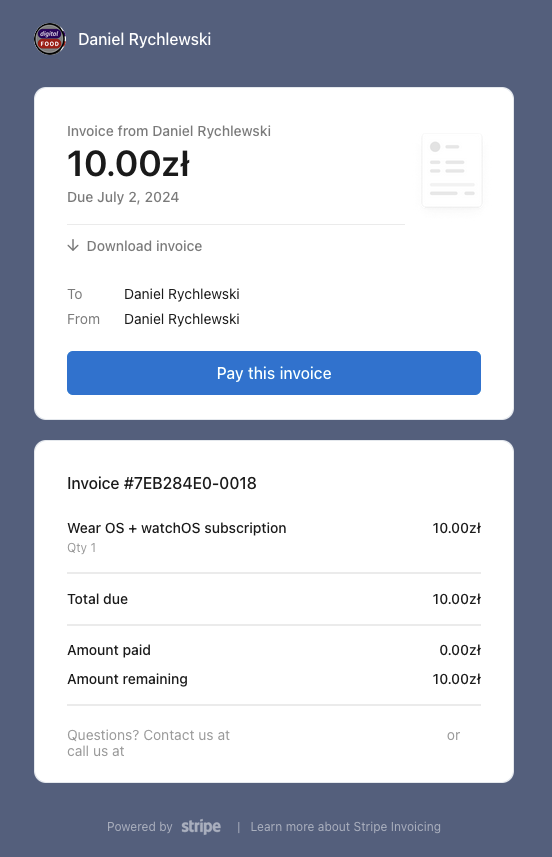
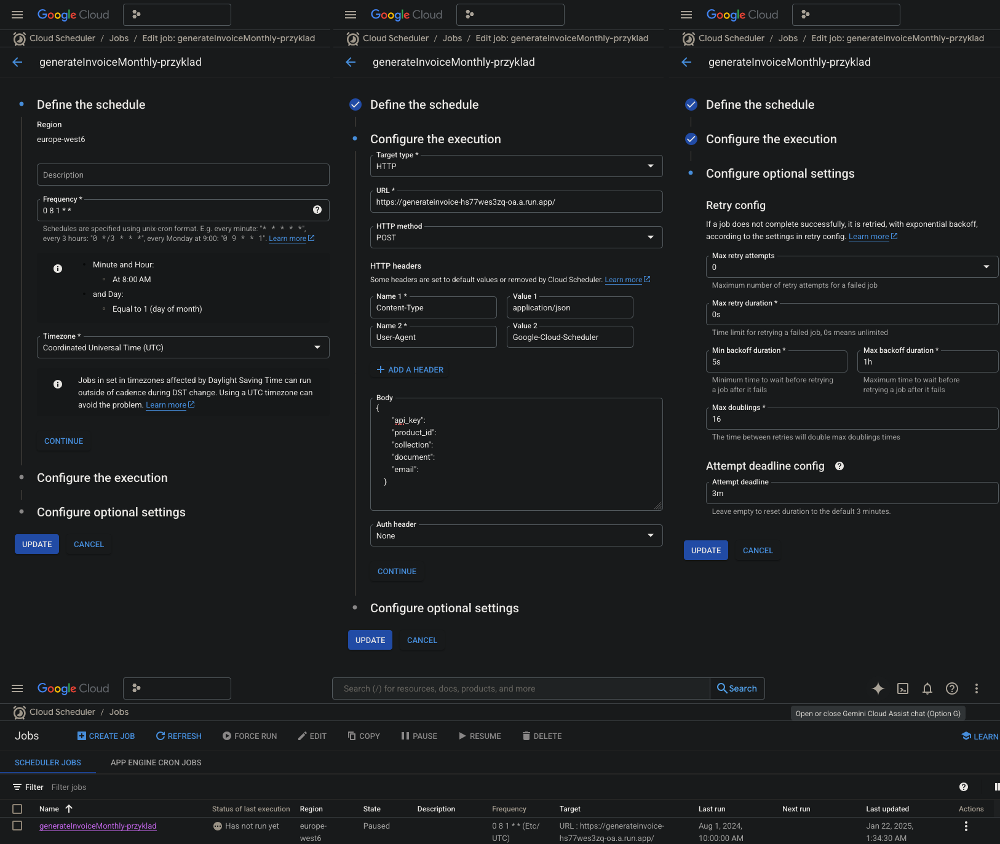

# Invoice generator

A Python-based Cloud Functions endpoint to automate sending invoices to clients when the payable due depends on the order value of their customers due to commission-based pricing.



## Deployment
Choose the correct `SERVICE_ACCOUNT_JSON` in `main.py` first. Then run:

gcloud functions deploy generateInvoice --region europe-west6 --runtime python39 --trigger-http --allow-unauthenticated

Alternatively, when you create the trigger via the cloud console, things will look like the following.



## Testing
```
curl --location --request POST 'redacted' \
--header 'Content-Type: application/json' \
--data-raw '{
        "api_key": "redacted",
        "product_id": "redacted",
        "collection": "redacted",
        "document": "redacted",
        "email": "redacted"
}'
```

## Scheduling (enter in Git Bash instead of cmd)
```
gcloud scheduler jobs create http generateInvoiceMonthly \
    --schedule="0 8 1 * *" \
    --uri="redacted" \
    --http-method=POST \
    --headers="Content-Type=application/json" \
    --location="europe-west6" \
    --message-body='{
        "api_key": "redacted",
        "product_id": "redacted",
        "collection": "redacted",
        "document": "redacted",
        "email": "redacted"
    }'
```